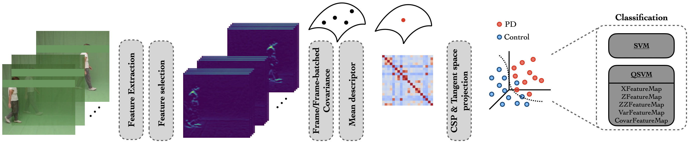

# Comparison of Quantum and RBF Kernels Using Support Vector Machine

This repository contains the source code and datasets associated with the paper entitled:

*"Parkinson Disease Classification: A Comparison of Quantum and RBF Kernels Using Support Vector Machine"*  

Gregoire Cattan 1, Juan Olmos 2,3, Yash Chauchan 4, Fabio Martínez 2

1  Data and AI IBM, Poland.

2  Biomedical Imaging, Vision and Learning Laboratory ([BIVL$^2$ab](https://bivl2ab.uis.edu.co/)), Universidad Industrial de Santander (UIS), Bucaramanga 680002,Colombia.

3  Unité d'Informatique et d'Ingénierie des Systèmes (U2IS), ENSTA Paris, Institut Polytechnique de Paris.  

4  School of Physical Sciences, National Institute of Science Education
and Research, An OCC of Homi Bhabha National Institute, Jatni, Bhubaneswar, 752050, Odisha, India.

  

 

## Datasets
The `data` folder contains the mean covariances datasets utilized in the research.

## Notebook
The Jupyter notebook `notebook_clean` presents the best pipeline (XFeatureMap) of the work described in the **paper**. 

## Citation

...
<!-- @inproceedings{2025qsvm,
title={Parkinson Disease Classification: A Comparison of Quantum and RBF Kernels Using Support Vector Machine},
author={Olmos, Juan and Galvis, Juan and Mart{\'\i}nez, Fabio},
booktitle={Ibero-American Conference on Artificial Intelligence},
pages={3--14},
year={2022}
} -->

## Project Structure
    ├── data                           <- Dataset folders and files.
    ...
    ├── notebook_clean.ipynb           <- Pipeline (XFeatureMap).    
    └── src                           <- Utility functions.

## Contact Information
For further information, contributions, or questions, feel free to contact the authors.
